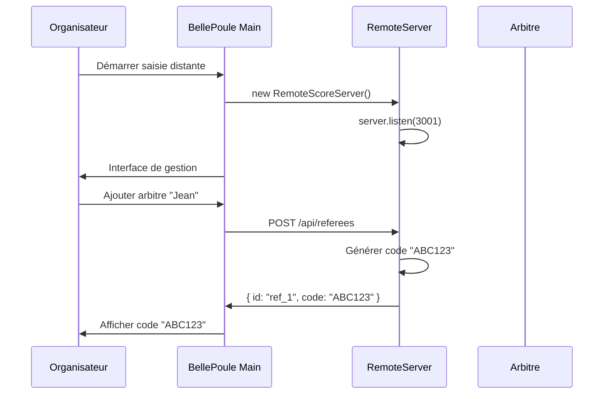
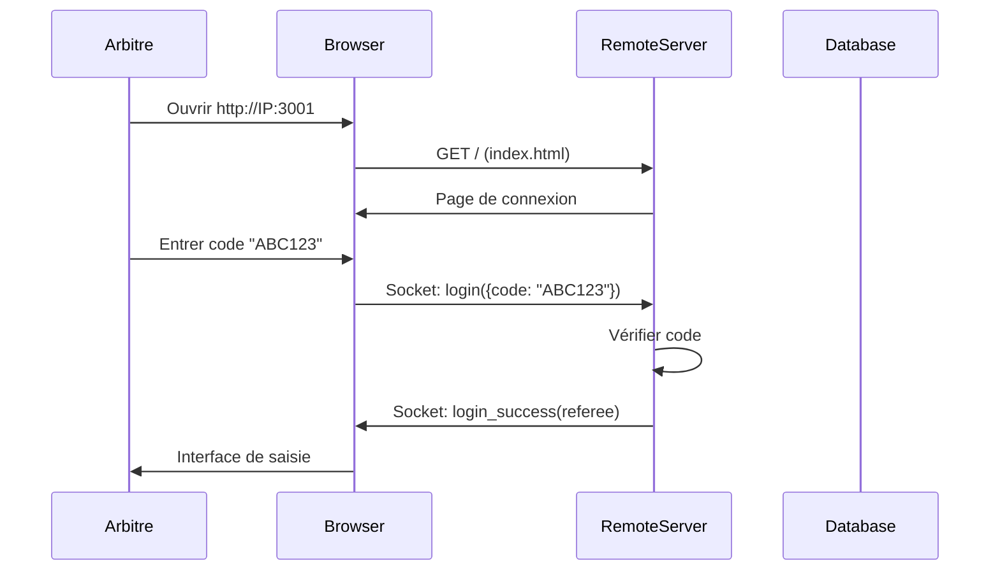
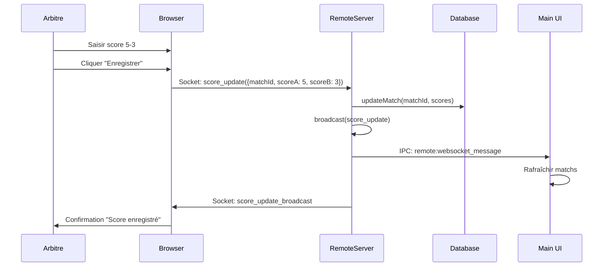

# BellePoule Modern - Architecture Développement

## 🏗️ Vue d'ensemble architecture

Le système de saisie distante s'intègre dans l'architecture existante de BellePoule Modern en ajoutant une couche de communication web pour les arbitres.

```
┌─────────────────────────────────────────────────────────────────┐
│                    B ELLEPOULE MODERN                           │
│                        (Electron)                              │
│                                                                 │
│  ┌─────────────────┐  ┌─────────────────┐  ┌─────────────────┐ │
│  │   Main Process  │  │  Renderer Proc  │  │   Database      │ │
│  │                 │  │                 │  │                 │ │
│  │ • mainWindow    │  │ • React UI      │  │ • SQLite        │ │
│  │ • IPC Handlers  │  │ • Competition   │  │ • Competitions  │ │
│  │ • RemoteScore   │  │ • Management    │  │ • Fencers       │ │
│  │   Server        │  │ • Interface     │  │ • Matches       │ │
│  └─────────────────┘  └─────────────────┘  └─────────────────┘ │
│           │                     │                     │       │
│           └─────────────────────┼─────────────────────┘       │
│                                 │                             │
│  ┌─────────────────────────────────────────────────────────┐   │
│  │              REMOTE SCORE SERVER                       │   │
│  │                                                         │   │
│  │  ┌─────────────┐  ┌─────────────┐  ┌─────────────────┐  │   │
│  │  │   Express   │  │  Socket.IO  │  │   Middleware    │  │   │
│  │  │   Server    │  │   Server    │  │                 │  │   │
│  │  │             │  │             │  │ • CORS          │  │   │
│  │  │ • REST API  │  │ • WebSocket │  │ • JSON Parser   │  │   │
│  │  │ • Static    │  │ • Real-time │  │ • Static Files  │  │   │
│  │  │   Files     │  │ • Events    │  │ • Session Mgmt  │  │   │
│  │  └─────────────┘  └─────────────┘  └─────────────────┘  │   │
│  └─────────────────────────────────────────────────────────┘   │
│                                 │                             │
│                                 ▼                             │
│  ┌─────────────────────────────────────────────────────────┐   │
│  │                NETWORK LAYER                            │   │
│  │                                                         │   │
│  │        Port 3001        HTTP/WebSocket                 │   │
│  │                                                         │   │
│  │  ┌─────────────┐  ┌─────────────┐  ┌─────────────────┐  │   │
│  │  │   Tablet 1  │  │   Tablet 2  │  │   Tablet N      │  │   │
│  │  │             │  │             │  │                 │  │   │
│  │  │ • Browser   │  │ • Browser   │  │ • Browser       │  │   │
│  │  │ • JS Client │  │ • JS Client │  │ • JS Client     │  │   │
│  │  │ • Score UI  │  │ • Score UI  │  │ • Score UI      │  │   │
│  │  └─────────────┘  └─────────────┘  └─────────────────┘  │   │
│  └─────────────────────────────────────────────────────────┘   │
└─────────────────────────────────────────────────────────────────┘
```

## 📁 Structure des fichiers

```
src/
├── main/
│   ├── main.ts                    # Processus principal Electron
│   ├── preload.ts                 # Bridge IPC
│   └── remoteScoreServer.ts       # 🆕 Serveur web distant
├── shared/
│   ├── types/
│   │   ├── index.ts              # Types principaux
│   │   └── remote.ts             # 🆕 Types pour saisie distante
│   └── utils/
│       └── [...existing files]   # Utilitaires existants
├── renderer/
│   └── components/
│       ├── CompetitionView.tsx   # 🔄 Intégration saisie distante
│       └── RemoteScoreManager.tsx # 🆕 Interface gestion distante
└── remote/                       # 🆕 Frontend web arbitres
    ├── index.html                 # Page principale arbitre
    ├── styles.css                 # Styles responsive
    └── app.js                     # Logique JavaScript vanilla
```

## 🔄 Flux de communication

### 1. Initialisation


### 2. Connexion arbitre


### 3. Saisie de score


## 🛠️ Architecture technique détaillée

### RemoteScoreServer - Backend Node.js

**Technologies** :
- **Express.js** : Serveur web HTTP
- **Socket.IO** : Communication WebSocket temps réel
- **TypeScript** : Typage strict
- **Node.js** : Runtime JavaScript

**Responsabilités** :
1. **Gestion HTTP** : API REST + fichiers statiques
2. **WebSocket** : Connexions arbitres temps réel
3. **Authentification** : Codes d'accès simples
4. **Synchronisation** : Scores ↔ Base de données
5. **Broadcast** : Diffusion des mises à jour

### Interface Web Arbitre - Frontend Vanilla JS

**Technologies** :
- **HTML5** : Structure sémantique
- **CSS3** : Styles modernes, responsive design
- **JavaScript ES6+** : Logique client
- **Socket.IO Client** : Communication WebSocket

**Caractéristiques** :
1. **Progressive Web App** : Utilisable hors ligne (futur)
2. **Responsive Design** : Mobile-first approach
3. **Temps réel** : Mises à jour instantanées
4. **Accessible** : Support clavier, lecteur écran

### RemoteScoreManager - Interface React

**Intégration** :
- **React Hooks** : Gestion d'état locale
- **TypeScript** : Typage strict
- **Fetch API** : Communication avec serveur distant
- **Electron IPC** : Contrôle serveur depuis UI

**Fonctionnalités** :
1. **Contrôle serveur** : Démarrage/arrêt
2. **Configuration** : Pistes, arbitres
3. **Monitoring** : État connexions
4. **Gestion** : Codes d'accès, sessions

## 🔌 Points d'extension

### 1. Authentification avancée
```typescript
interface AdvancedAuth {
  username: string;
  password: string;
  role: 'referee' | 'organizer' | 'admin';
  permissions: string[];
}
```

### 2. Mode hors ligne
```typescript
interface OfflineMode {
  queue: ScoreUpdate[];
  syncStatus: 'online' | 'offline' | 'syncing';
  lastSync: Date;
}
```

### 3. Multi-compétitions
```typescript
interface MultiCompetition {
  competitions: Competition[];
  currentCompetition: string;
  globalSettings: GlobalSettings;
}
```

## 🧪 Tests et qualité

### Tests unitaires (à implémenter)
```typescript
// Tests RemoteScoreServer
describe('RemoteScoreServer', () => {
  test('should start server on port 3001');
  test('should generate unique referee codes');
  test('should handle score updates correctly');
});

// Tests interface web
describe('Referee Interface', () => {
  test('should connect with valid code');
  test('should submit scores');
  test('should handle disconnection');
});
```

### Tests d'intégration
```typescript
// Tests E2E avec Playwright
test('Complete remote scoring workflow', async () => {
  // 1. Organisateur démarre session
  // 2. Arbitre se connecte
  // 3. Saisie score
  // 4. Vérification synchronisation
});
```

## 🔒 Sécurité

### Mesures actuelles
1. **Codes d'accès** : 6 caractères aléatoires
2. **Session limitée** : Durée compétition
3. **Réseau local** : WiFi interne

### Améliorations futures
1. **HTTPS/WSS** : Chiffrement communications
2. **JWT Tokens** : Authentification robuste
3. **Rate Limiting** : Protection anti-DoS
4. **Input Validation** : Validation stricte scores

## 📊 Monitoring et logs

### Logs serveur
```typescript
// Structure de logs
interface LogEntry {
  timestamp: Date;
  level: 'info' | 'warn' | 'error';
  component: 'server' | 'websocket' | 'database';
  message: string;
  metadata?: any;
}
```

### Métriques à suivre
1. **Performance** : Temps réponse API
2. **Utilisation** : Nombre arbitres connectés
3. **Erreurs** : Échecs connexions/synchronisations
4. **Réseau** : Latence WebSocket

## 🚀 Déploiement

### Configuration production
```typescript
interface ProductionConfig {
  port: number;
  cors: {
    origin: string[];
    credentials: boolean;
  };
  ssl?: {
    key: string;
    cert: string;
  };
  database: {
    backup: boolean;
    interval: number;
  };
}
```

### Dockerisation (futur)
```dockerfile
FROM node:18-alpine
WORKDIR /app
COPY package*.json ./
RUN npm ci --only=production
COPY dist/ ./dist/
EXPOSE 3001
CMD ["node", "dist/main/remoteScoreServer.js"]
```

---

Cette architecture permet une évolution progressive tout en maintenant une compatibilité avec l'existant de BellePoule Modern.