# BellePoule Modern - Saisie Distante des Scores

## Vue d'ensemble

La fonctionnalité de saisie distante permet aux arbitres de saisir les scores des matchs directement depuis une tablette ou un navigateur web, sans avoir à utiliser l'application principale. Les scores sont synchronisés en temps réel avec l'application principale BellePoule Modern.

## Architecture du système

```mermaid
graph TB
    subgraph "Application Principale (Electron)"
        A[Interface Principale] --> B[RemoteScoreManager]
        B --> C[RemoteScoreServer]
        C --> D[(Base de données)]
    end
    
    subgraph "Serveur Web (Port 3001)"
        C --> E[API REST]
        C --> F[WebSocket Server]
        E --> G[Routes HTTP]
        F --> H[Socket.IO]
    end
    
    subgraph "Interface Arbitre (Web)"
        I[index.html] --> J[app.js]
        J --> K[styles.css]
        K --> L[Socket.IO Client]
        L --> F
    end
    
    subgraph "Tablettes Arbitres"
        M[Navigateur Web] --> I
        N[Navigateur Web] --> I
        O[Navigateur Web] --> I
    end
    
    style A fill:#e1f5fe
    style B fill:#f3e5f5
    style C fill:#e8f5e8
    style I fill:#fff3e0
    style M fill:#fce4ec
    style N fill:#fce4ec
    style O fill:#fce4ec
```



## Composants principaux

### 1. RemoteScoreServer (`src/main/remoteScoreServer.ts`)

**Rôle** : Serveur principal qui gère la communication avec les arbitres

**Fonctionnalités** :
- Serveur web Express (port 3001 par défaut)
- Serveur WebSocket (Socket.IO) pour la communication en temps réel
- Gestion des sessions de saisie distante
- Authentification des arbitres par code d'accès
- Synchronisation des scores avec la base de données

**Endpoints API** :
- `GET /` : Interface web arbitre
- `GET /api/session` : Informations de session active
- `POST /api/session/start` : Démarrer une session
- `POST /api/session/stop` : Arrêter une session
- `POST /api/referees` : Ajouter un arbitre
- `POST /api/matches/:matchId/score` : Mettre à jour un score

**Événements WebSocket** :
- `login` : Connexion d'un arbitre
- `score_update` : Mise à jour d'un score
- `match_complete` : Finalisation d'un match
- `heartbeat` : Maintien de connexion

### 2. Interface Web Arbitre (`src/remote/`)

**Rôle** : Interface web pour les arbitres sur tablette

**Fichiers** :
- `index.html` : Structure de la page
- `styles.css` : Style responsive et moderne
- `app.js` : Logique JavaScript (Vanilla JS)

**Fonctionnalités** :
- Connexion par code d'accès
- Affichage du match en cours
- Saisie des scores
- Gestion des statuts spéciaux (abandon, forfait, exclusion)
- Navigation vers le match suivant
- Notifications en temps réel

### 3. RemoteScoreManager (`src/renderer/components/RemoteScoreManager.tsx`)

**Rôle** : Composant React pour gérer la saisie distante depuis l'application principale

**Fonctionnalités** :
- Démarrage/arrêt du serveur distant
- Configuration des pistes et arbitres
- Visualisation de l'état des connexions
- Génération des codes d'accès
- Surveillance de l'activité des arbitres

## Flux de travail

### 1. Configuration par l'organisateur

1. Dans BellePoule Modern, aller dans l'onglet "📡 Saisie distante"
2. Cliquer sur "⚡ Démarrer la saisie distante"
3. Configurer le nombre de pistes disponibles
4. Ajouter les arbitres avec leurs noms
5. Noter les codes d'accès générés pour chaque arbitre

### 2. Connexion des arbitres

1. Sur chaque tablette, ouvrir un navigateur web
2. Aller à l'adresse : `http://<IP-ordinateur>:3001`
3. Entrer le code d'accès fourni par l'organisateur
4. L'interface affiche le match assigné à la piste

### 3. Saisie des scores

1. L'arbitre voit les informations du match (tireurs, piste)
2. Il saisit les scores pour chaque tireur
3. Pour les cas spéciaux : cocher "Statut spécial" (abandon/forfait/exclusion)
4. Cliquer sur "Enregistrer le score"
5. Le score est synchronisé immédiatement avec l'application principale
6. Cliquer sur "Match suivant" pour passer au match suivant

## Sécurité et réseau

### Configuration réseau

- **Port par défaut** : 3001
- **Protocole** : HTTP + WebSocket
- **CORS** : Configuré pour accepter toutes les origines (à restreindre en production)
- **Pas d'authentification** : Basé sur des codes d'accès simples

### Bonnes pratiques

1. **Réseau local** : Fonctionne sur le même réseau WiFi
2. **URL d'accès** : Utiliser l'adresse IP de l'ordinateur principal
3. **Codes d'accès** : Générés aléatoirement, 6 caractères
4. **Session** : Limitée à la durée de la compétition

## Installation et utilisation

### Prérequis

- Node.js et les dépendances du projet
- Réseau WiFi fonctionnel
- Tablettes ou navigateurs web compatibles

### Démarrage

1. **Depuis l'interface** :
   - Menu Competition → "⚡ Démarrer saisie distante"
   - Ou via l'onglet "📡 Saisie distante"

2. **Manuellement** (développement) :
   ```bash
   npm run build
   npm start
   # Le serveur démarre automatiquement sur le port 3001
   ```

### Dépannage

#### Problèmes courants

1. **"Impossible de se connecter"**
   - Vérifier que l'ordinateur et la tablette sont sur le même réseau
   - Vérifier l'adresse IP utilisée
   - Confirmer que le port 3001 n'est pas bloqué par un firewall

2. **"Code d'accès invalide"**
   - Vérifier que le code a été correctement saisi
   - Confirmer que l'arbitre a été ajouté dans l'interface principale

3. **"Scores non synchronisés"**
   - Vérifier la connexion WebSocket (icône verte)
   - Actualiser la page de l'arbitre
   - Redémarrer le serveur si nécessaire

#### Logs et调试

Les logs du serveur sont visibles dans la console de l'application Electron principale :

```
Remote score server started on port 3001
Arbitres peuvent se connecter sur: http://localhost:3001
Referee John Doe connected with code ABC123
```

## Évolution et améliorations

### Fonctionnalités futures envisagées

1. **Authentification renforcée** : Mots de passe personnalisés
2. **Mode hors ligne** : Synchronisation différée
3. **Historique** : Consultation des matchs précédents
4. **Export** : Générer un PDF des résultats de piste
5. **Multi-competitions** : Gérer plusieurs compétitions simultanément
6. **Interface mobile** : Application native iOS/Android

### Améliorations techniques

1. **HTTPS** : Support du SSL pour la sécurité
2. **PWA** : Application web progressive pour les tablettes
3. **Notifications push** : Alertes pour les nouveaux matchs
4. **Optimisation** : Cache et performances réseau

## Contribution

Pour modifier ou améliorer la saisie distante :

1. **Backend** : `src/main/remoteScoreServer.ts`
2. **Frontend web** : `src/remote/`
3. **Interface principale** : `src/renderer/components/RemoteScoreManager.tsx`
4. **Types** : `src/shared/types/remote.ts`

Les tests peuvent être effectués en local avec plusieurs navigateurs ou périphériques sur le même réseau.