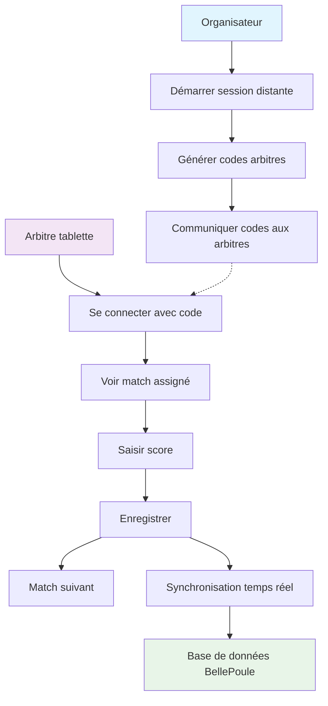

# BellePoule Modern - Guide de la saisie distante

🎯 **Objectif** : Permettre aux arbitres de saisir les scores depuis une tablette via navigateur web

## 🚀 Démarrage rapide

### 1. Dans BellePoule Modern
1. Allez dans l'onglet **"📡 Saisie distante"**
2. Cliquez sur **"⚡ Démarrer la saisie distante"**
3. Configurez le nombre de pistes
4. Ajoutez vos arbitres

### 2. Sur les tablettes arbitres
1. Ouvrez un navigateur web
2. Allez à : `http://<IP-ordinateur>:3001`
3. Entrez le code d'accès fourni
4. Saisissez les scores !

## 📋 Flux de travail



## 🏗️ Architecture technique

```
┌─────────────────┐    ┌─────────────────┐    ┌─────────────────┐
│   BellePoule    │    │  Serveur Web    │    │   Tablette      │
│   (Electron)    │◄──►│   (Port 3001)   │◄──►│   Arbitre       │
│                 │    │                 │    │                 │
│ • Gestion      │    │ • API REST      │    │ • Navigateur    │
│ • Base de      │    │ • WebSocket      │    │ • Saisie score  │
│   données      │    │ • Socket.IO     │    │                 │
└─────────────────┘    └─────────────────┘    └─────────────────┘
```

## 📱 Interface arbitre

### Écran de connexion
- **Code d'accès** : 6 caractères (ex: ABC123)
- **Généré automatiquement** par l'application principale

### Écran de saisie
- **Infos match** : Tireurs, clubs, piste
- **Saisie scores** : Input numériques
- **Statuts spéciaux** : Abandon/Forfait/Exclusion
- **Actions** : Enregistrer / Match suivant

## 🔧 Configuration

### Paramètres de session
- **Port par défaut** : 3001
- **Pistes** : 1-20 (configurable)
- **Arbitres** : Illimité (avec codes uniques)
- **Réseau** : WiFi local obligatoire

### Codes d'accès
- **Format** : 6 caractères alphanumériques
- **Exemple** : XY12Z3, ABC123, 9JK8LM
- **Sécurité** : Uniques par session

## 🌐 Utilisation réseau

### Trouver l'adresse IP
```bash
# Windows
ipconfig

# macOS/Linux
ifconfig
# ou
ip addr show
```

### URL d'accès pour les arbitres
```
http://192.168.1.100:3001
```
*(Remplacer 192.168.1.100 par l'IP de l'ordinateur principal)*

## ⚡ Synchronisation en temps réel

### Technologies utilisées
- **WebSocket** : Communication bidirectionnelle
- **Socket.IO** : Gestion des connexions
- **REST API** : État des sessions

### Flux de données
1. **Arbitre saisit score** → WebSocket → Serveur
2. **Serveur traite** → Base de données → WebSocket
3. **Application principale** → Mise à jour UI automatique

## 🚨 Dépannage

### "Connexion impossible"
✅ **Vérifications** :
- Même réseau WiFi ?
- Bonne adresse IP ?
- Port 3001 non bloqué ?
- Serveur démarré ?

### "Code invalide"
✅ **Solutions** :
- Vérifier la casse (majuscules/minuscules)
- Confirmer que l'arbitre est bien ajouté
- Régénérer un nouveau code si besoin

### "Scores non synchronisés"
✅ **Actions** :
- Vérifier icône de connexion 🟢
- Actualiser la page (F5)
- Redémarrer le serveur distant

## 🎯 Bonnes pratiques

### Pour l'organisateur
1. **Test préalable** : Valider la connexion avec une tablette
2. **Codes écrits** : Notez les codes sur papier pour éviter les erreurs
3. **Réseau stable** : Privilégier un WiFi dédié si possible
4. **Backup** : Gardez une méthode de saisie manuelle au cas où

### Pour les arbitres
1. **Navigateur moderne** : Chrome, Firefox, Safari récents
2. **Mode paysage** : Plus confortable pour la saisie
3. **WiFi stable** : Éviter les zones de mauvaise réception
4. **Confirmation** : Vérifier le score avant validation

## 📊 Monitoring

### Dans BellePoule Modern
- **État des pistes** : Disponible/Occupée/Maintenance
- **Arbitres connectés** : 🟢 en ligne / 🔴 hors ligne
- **Activité** : Dernière action de chaque arbitre
- **Matchs en cours** : Suivi en temps réel

### Indicateurs visuels
- 🟢 **Connecté** : Tout fonctionne normalement
- 🔴 **Déconnecté** : Perte de connexion
- 🟡 **Instable** : Connexion intermittente

## 🔮 Évolutions futures

### Améliorations prévues
1. **Application mobile native** (iOS/Android)
2. **Mode hors ligne** avec synchronisation différée
3. **Historique des matchs** par arbitre
4. **Notifications push** pour nouveaux matchs
5. **Export PDF** des feuilles de piste

### Contributions possibles
- 🎨 **Améliorations UI/UX**
- 🔒 **Sécurité renforcée**
- 📱 **Support mobile avancé**
- 🌍 **Multi-langues**

---
**Documentation maintenue par l'équipe BellePoule Modern**  
📧 Pour toute question : issues GitHub du projet