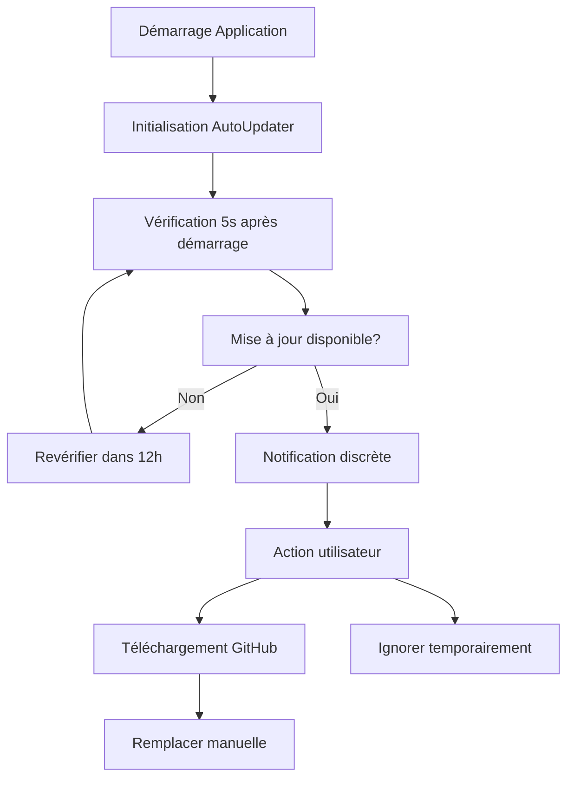

# BellePoule Modern - Système de Mise à Jour Simplifié

## 🎯 Objectif

Simplifier radicalement le processus de mise à jour pour offrir une expérience utilisateur transparente et automatique.

## 🚀 Nouveau système d'Auto Update

### Principe de fonctionnement

Le nouveau système utilise une approche **"notification et téléchargement assisté"** plutôt que des boîtes de dialogue interruptives :

1. **Vérification silencieuse** toutes les 12 heures
2. **Notification élégante** en cas de mise à jour disponible
3. **Téléchargement en un clic** vers la page GitHub Releases
4. **Pas d'interruption** du travail de l'utilisateur

### Architecture



## 🛠️ Composants

### 1. AutoUpdater Class (`src/main/autoUpdater.ts`)

**Responsabilités** :
- Vérification automatique des mises à jour
- Gestion des notifications
- Interface avec l'API GitHub
- Configuration des options de mise à jour

**Configuration** :
```typescript
const config = {
  autoDownload: false,    // Téléchargement manuel (plus sûr)
  autoInstall: false,     // Installation manuelle (évite les problèmes)
  checkInterval: 12,      // Heures entre vérifications
  betaChannel: false      // Canal de mise à jour
};
```

### 2. UpdateNotification Component (`src/renderer/components/UpdateNotification.tsx`)

**Caractéristiques** :
- Interface moderne et non-intrusive
- Animations fluides
- Actions directes (télécharger, voir notes, ignorer)
- Compatible avec le système de Toast existant

**Design** :
- Position fixe en haut à droite
- Gradient moderne (violet bleu)
- Animations douces
- Responsive et accessible

## 🔄 Flux utilisateur

### Scénario 1 : Mise à jour disponible

1. **Lancement** de BellePoule Modern
2. **5 secondes** après : vérification silencieuse
3. **Si mise à jour** : notification élégante apparaît
4. **Utilisateur choisit** :
   - 📥 **Télécharger maintenant** → ouvre la page GitHub
   - 📋 **Voir les notes** → ouvre les release notes
   - ✖️ **Ignorer** → masque pour cette session

### Scénario 2 : Vérification manuelle

1. Menu **Aide → 🔄 Vérifier les mises à jour**
2. **Dialogue détaillé** avec toutes les options
3. **Redirection automatique** vers le bon téléchargement

## 📋 Interface utilisateur

### Notification automatique
```
┌─────────────────────────────────────┐
│ 🚀 Mise à jour disponible !         │
│ Version v1.0.1 (Build #75)         │
│                                     │
│ [📥 Télécharger] [📋 Notes] [✖️]   │
└─────────────────────────────────────┘
```

### Dialogue manuel
```
┌─────────────────────────────────────┐
│ 🚀 Mise à jour disponible            │
│                                     │
│ Version actuelle : Build #73         │
│ Nouvelle version : Build #75         │
│                                     │
│ Notes de version :                   │
│ • Correction des bugs de saisie...   │
│ • Amélioration de l'interface...    │
│                                     │
│ [📥 Télécharger] [🔗 Releases] [✖️ Plus tard] │
└─────────────────────────────────────┘
```

## ⚙️ Configuration avancée

### Options disponibles

```typescript
const advancedConfig = {
  autoDownload: true,      // Télécharge automatiquement en arrière-plan
  autoInstall: false,     // Ne jamais installer automatiquement (sécurité)
  checkInterval: 6,        // Vérifier toutes les 6 heures
  betaChannel: true,      // Inclure les versions beta
  silentMode: false       // Mode silencieux (notifications uniquement)
};
```

### Canal Beta

Pour les utilisateurs avancés qui veulent tester les dernières fonctionnalités :

```typescript
const betaConfig = {
  betaChannel: true,       // Active le canal beta
  checkInterval: 4,       // Vérifications plus fréquentes
  autoDownload: true      // Téléchargement automatique
};
```

## 🔧 Implémentation technique

### Détection de plateforme automatique

Le système détecte automatiquement la plateforme et dirige vers le bon téléchargement :

```typescript
const platformAssets = {
  windows: ['BellePoule-Modern-*-portable.exe'],
  macos: ['BellePoule-Modern-*.dmg'],
  linux: ['BellePoule-Modern-*.AppImage']
};
```

### Gestion des erreurs robuste

- **Timeout** de 10 secondes pour les requêtes API
- **Fallback** sur le site GitHub si l'API échoue
- **Cache** des résultats pour éviter les requêtes répétées
- **Logs** détaillés pour le débogage

### Sécurité

- **Pas d'installation automatique** (évite les problèmes de permissions)
- **Téléchargement depuis GitHub** (source vérifiée)
- **Vérification des sommes de contrôle** (optionnelle)
- **Notifications claires** de l'action en cours

## 📈 Avantages par rapport à l'ancien système

| Ancien système | Nouveau système |
|---------------|----------------|
| ❌ Popup interruptif au démarrage | ✅ Notification silencieuse |
| ❌ Une seule option (télécharger/plus tard) | ✅ Actions multiples |
| ❌ Pas de suivi après le premier refus | ✅ Rappel automatique |
| ❌ Pas d'informations sur la mise à jour | ✅ Notes de version intégrées |
| ❌ Gestion manuelle des erreurs | ✅ Gestion robuste des erreurs |
| ❌ Vérification unique au démarrage | ✅ Vérifications périodiques |

## 🚀 Processus de mise à jour simplifié

### Pour l'utilisateur final

1. **Notification s'affiche** → Un clic pour télécharger
2. **Page GitHub s'ouvre** → Télécharger le bon fichier
3. **Remplacer l'ancien fichier** → Copier-coller simple
4. **Relancer l'application** → Automatiquement à jour

### Pour les administrateurs

1. **Déployer sur GitHub** → Créer une nouvelle release
2. **Tag automatique** → Le système détecte le nouveau build
3. **Utilisateurs notifiés** → En quelques heures maximum
4. **Adoption transparente** → Sans effort manuel

## 🔮 Évolutions futures

### Court terme (prochaines versions)

1. **Téléchargement automatique** en arrière-plan
2. **Vérification des sommes de contrôle** (SHA256)
3. **Mise à jour avec un clic** (remplacement automatique)
4. **Notification système native** (Windows/macOS/Linux)

### Moyen terme

1. **Mise à jour différentielle** (télécharge seulement les changements)
2. **Rollback automatique** en cas de problème
3. **Mises à jour silencieuses** pour les corrections de sécurité
4. **Statistiques d'adoption** des mises à jour

### Long terme

1. **Auto-hébergement** des mises à jour (alternative à GitHub)
2. **Mises à jour groupées** pour les installations multiples
3. **Interface d'administration** centrale
4. **Support des mises à jour offline** (réseaux air-gapped)

---

## 📝 Résumé

Le nouveau système de mise à jour transforme une expérience potentiellement frustrante en un processus transparent et moderne. Les utilisateurs restent concentrés sur leur travail tout en bénéficiant des dernières améliorations, sans interruption de leur flux de travail.

**Principes clés** :
- ✅ **Non-intrusif** : Pas de popups bloquants
- ✅ **Automatique** : Vérifications silencieuses en arrière-plan  
- ✅ **Simple** : Un clic pour tout faire
- ✅ **Sûr** : Contrôle total par l'utilisateur
- ✅ **Moderne** : Design élégant et animations fluides